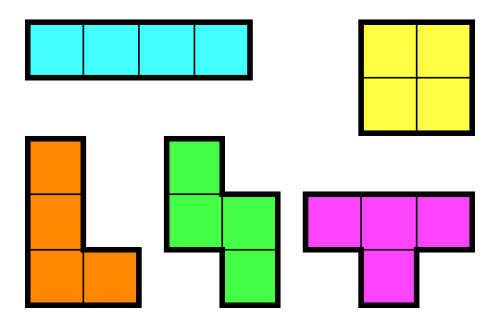
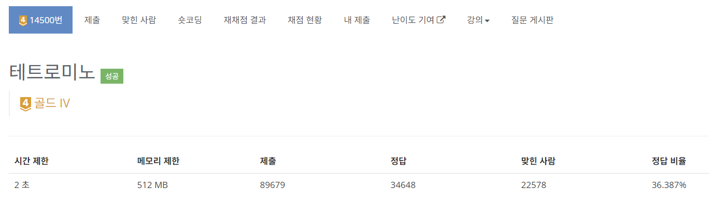

# [백준] 14500 - 테트로미노
> GOlD IV

```브루트 포스```

## 문제
폴리오미노란 크기가 1×1인 정사각형을 여러 개 이어서 붙인 도형이며, 다음과 같은 조건을 만족해야 한다.

정사각형은 서로 겹치면 안 된다.
도형은 모두 연결되어 있어야 한다.
정사각형의 변끼리 연결되어 있어야 한다. 즉, 꼭짓점과 꼭짓점만 맞닿아 있으면 안 된다.
정사각형 4개를 이어 붙인 폴리오미노는 테트로미노라고 하며, 다음과 같은 5가지가 있다.



아름이는 크기가 N×M인 종이 위에 테트로미노 하나를 놓으려고 한다. 종이는 1×1 크기의 칸으로 나누어져 있으며, 각각의 칸에는 정수가 하나 쓰여 있다.

테트로미노 하나를 적절히 놓아서 테트로미노가 놓인 칸에 쓰여 있는 수들의 합을 최대로 하는 프로그램을 작성하시오.

테트로미노는 반드시 한 정사각형이 정확히 하나의 칸을 포함하도록 놓아야 하며, 회전이나 대칭을 시켜도 된다.

## 입력
첫째 줄에 종이의 세로 크기 N과 가로 크기 M이 주어진다. (4 ≤ N, M ≤ 500)

둘째 줄부터 N개의 줄에 종이에 쓰여 있는 수가 주어진다. i번째 줄의 j번째 수는 위에서부터 i번째 칸, 왼쪽에서부터 j번째 칸에 쓰여 있는 수이다. 입력으로 주어지는 수는 1,000을 넘지 않는 자연수이다.

## 출력
첫째 줄에 테트로미노가 놓인 칸에 쓰인 수들의 합의 최댓값을 출력한다.

## 풀이
테트로미노의 모양을 모두 고려하여 대입해보고 그 중 최댓값을 찾는 *브루트포스 알고리즘* 문제이다.

나올 수 있는 테트로미노의 모양이 19개로 좀 많아 여기서 실수하지만 않으면 그다지 어렵지 않은 문제다.

```C
int tetromino[19][2][4] =    
{
    { {0, 1, 2, 3}, {0, 0, 0, 0} }, // 1
    { {0, 0, 0, 0}, {0, -1, -2, -3} }, // 2
    { {0, 1, 0, 1}, {0, 0, -1, -1} }, // 3
    { {0, 0, 0, 1}, {0, -1, -2, -2} }, // 4
    { {0, 1, 2, 0}, {0, 0, 0, -1} }, // 5
    { {0, 1, 1, 1}, {0, 0, -1, -2} }, // 6
    { {0, 1, 2, 2}, {-1, -1, -1, 0} }, // 7
    { {1, 1, 0, 1}, {0, -1, -2, -2} }, // 8
    { {0, 0, 1, 2}, {0, -1, -1, -1} }, // 9
    { {0, 1, 0, 0}, {0, 0, -1, -2} }, // 10
    { {0, 1, 2, 2}, {0, 0, 0, -1} }, // 11
    { {0, 0, 1, 1}, {0, -1, -1, -2} }, // 12
    { {1, 2, 0, 1}, {0, 0, -1, -1} }, // 13
    { {1, 0, 1, 0}, {0, -1, -1, -2} }, // 14
    { {0, 1, 1, 2}, {0, 0, -1, -1} }, // 15
    { {0, 1, 2, 1}, {0, 0, 0, -1} }, // 16
    { {1, 0, 1, 1}, {0, -1, -1, -2} }, // 17
    { {1, 0, 1, 2}, {0, -1, -1, -1} }, // 18
    { {0, 0, 1, 0}, {0, -1, -1, -2} }, // 19
};
```

블럭 하나를 원점으로 삼아, 그것을 기준으로 좌표를 할당해주면된다.

> 

{x 좌표}, {y 좌표} 로 배열을 이용해 표현해주었다.


종이의 ```(n+1) * (m+1)```로 동적할당하여 2차원 배열로 만들어주었으며, 1행, 1열, n+1행, m+1열은 -1로 초기화해주었다.

```C
int answer = 0;
for (int i = 1; i < n+1; i++){
    for (int k = 1; k < m+1; k++) {
        for (int j = 0; j < 19; j++) {
            int tmp = 0;
            for (int t = 0; t < 4; t++) {
                if (block[i+tetromino[j][0][t]][k+tetromino[j][1][t]] == -1){
                    tmp = 0;
                    break;
                }
                tmp += block[i+tetromino[j][0][t]][k+tetromino[j][1][t]];
            }
            if(answer < tmp)
                answer = tmp;
        }
    }
}
```

4중 반복문이라 좀 어지럽기는 한데, 종이의 모든 좌표에 대해서, 모든 테트로미노를 대입해서 비교하는 간단한 기능이다.

이러고 answer 출력해주면 끝.

