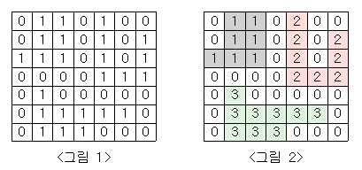

# [백준] 2667 - 단지번호붙이기
> Silver I

## 문제
<그림 1>과 같이 정사각형 모양의 지도가 있다. 1은 집이 있는 곳을, 0은 집이 없는 곳을 나타낸다. 철수는 이 지도를 가지고 연결된 집의 모임인 단지를 정의하고, 단지에 번호를 붙이려 한다. 여기서 연결되었다는 것은 어떤 집이 좌우, 혹은 아래위로 다른 집이 있는 경우를 말한다. 대각선상에 집이 있는 경우는 연결된 것이 아니다. <그림 2>는 <그림 1>을 단지별로 번호를 붙인 것이다. 지도를 입력하여 단지수를 출력하고, 각 단지에 속하는 집의 수를 오름차순으로 정렬하여 출력하는 프로그램을 작성하시오.




## 입력
첫 번째 줄에는 지도의 크기 N(정사각형이므로 가로와 세로의 크기는 같으며 5≤N≤25)이 입력되고, 그 다음 N줄에는 각각 N개의 자료(0혹은 1)가 입력된다.

## 출력
첫 번째 줄에는 총 단지수를 출력하시오. 그리고 각 단지내 집의 수를 오름차순으로 정렬하여 한 줄에 하나씩 출력하시오.

## 풀이

깊이 우선 탐색 (DFS)와 너비 우선 탐색(BFS) 두 방법으로 풀 수 있는 문제이다. C언어세는 큐가 구현이 안 되어 있으므로, 간단하게 DFS 방식으로 풀이했다.

map을 map[0][0] 부터 map[n-1][n-1]까지 전부 둘러보면서, 1이 나오면 DFS 함수를 호출한다.

```C
int *counting_sort = (int*)calloc((n*n + 1), sizeof(int));
// 모든 원소를 0으로 초기화하면서 할당
// counting sort를 위한 1차원 배열
int complex = 0; // 아파트 단지수
for (int i = 0; i < n; i++){
    for (int k = 0; k < n; k++){
        cnt = 0;
        if(map[i][k] == 1){
            dfs(i ,k);
            counting_sort[cnt]++;
            complex++;
        }
    } 
}
```

> 정렬을 빠르게 하기 위해 Counting Sort 방식을 사용했다.

```C
void dfs(int x, int y) {
    map[x][y] = 0; // 방문했다는 의미
    cnt++;

    int dx[4] = {1, -1, 0, 0};
    int dy[4] = {0, 0, -1, 1};

    for(int i=0; i<4; i++) {
        if(x + dx[i] < 0 || x + dx[i] >= n || y + dy[i] < 0 || y + dy[i] >= n)
            continue;

        if(map[x + dx[i]][y + dy[i]] == 1){
            dfs(x + dx[i], y + dy[i]);            
        }
    }
}
```

방문했는지 확인하는 배열은 따로 만들지 않고 탐색하는 집 map[x][y] 를 0으로 바꾸는 것으로 방문 표시를 했다. 모든 탐색이 끝나고 **cnt** 변수에 담긴 수가 탐색한 단지내의 집의 수가 된다.

